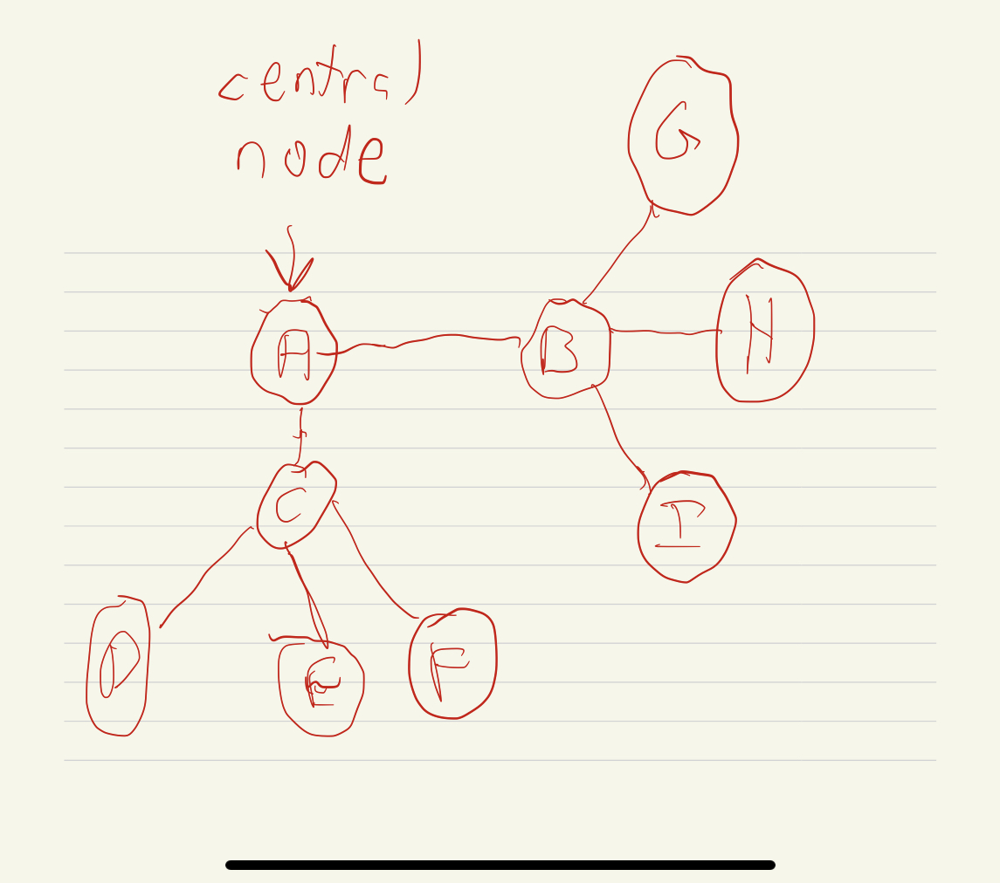
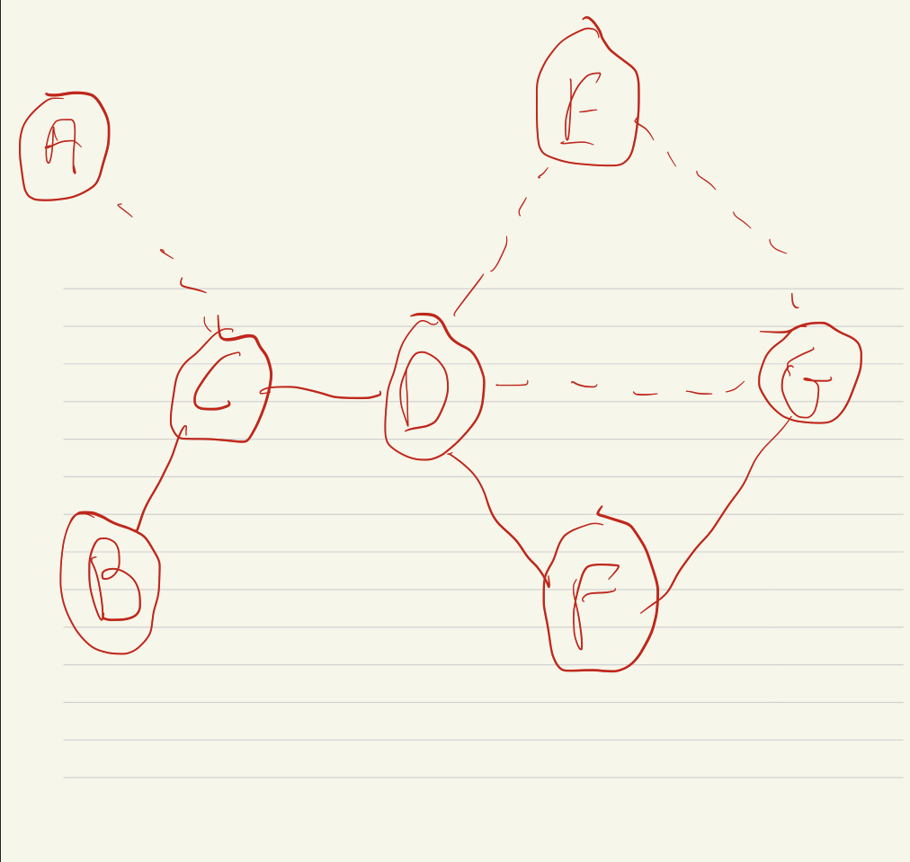
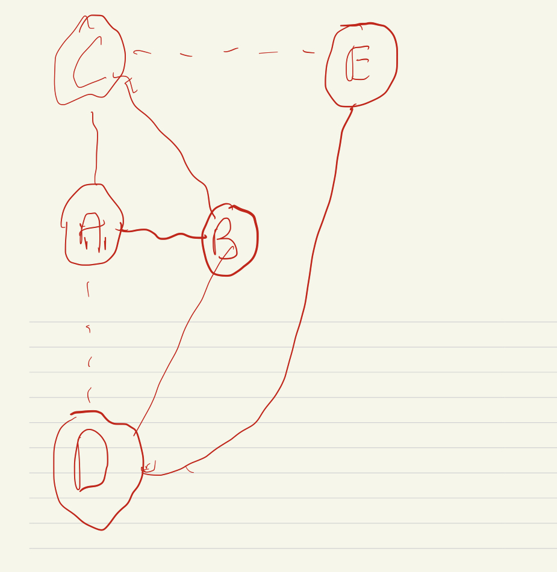

```{r setup, include=FALSE}
knitr::opts_chunk$set(echo = TRUE)
```
**1.)**A group of economists are studying the interactions between 10 banks. They drew the
graph in Figure 1 to describe these interactions with nodes representing the banks and edges
between two nodes representing the idea that these two banks interact with each other. So for
example, banks A and D interact, but banks A and B do not interact. These “interactions”
are meant to describe economic transactions between the banks.
These economists are interested in measuring how important individual banks are purely
as a function of their location in this network. One way they are considering is to count the
degree of each bank. The degree of a node in an undirected graph such as Figure 1 is the
number of edges attached to the node.

**A.)**For each node in Figure 1, what is it’s degree?

* A has a degree of 1

* B has a degree of 1

* C has a degree of 1

* D has a degree of 4

* E has a degree of 1

* F has a degree of 1

* G has a degree of 1

* H has a degree of 1

* I has a degree of 1

* J has a degree of 6

**b.)** For each node in Figure 1 how many connected components would the graph have if
this bank was removed from the graph?

* A would have 1 component

* B would have 1 component

* C would have 1 component

* D would have 4 components

* E would have 1 component

* F would have 1 component

* G would have 1 component

* H would have 1 component

* I would have 1 component

* J would have 6 components

**c.)** Is there a bank (or banks) in Figure 1 with the property that the maximum distance
from this bank to any other bank at most 2? If there is, name all such banks and say why
they have this property. If there isn’t, give a brief explanation why not.

There is in fact two such nodes that have this property being nodes D and J. I say this because these two nodes are located in the center of this network allowing them to easily access all the other nodes. They have a distance of 1 to all the nodes connected on their side and if they want to go to the other side they would pass through the other central node which is one and then to whatever other node they need to get to which gives a distance of 2.

**d.)**In the example given in Figure 1 there is a close connection between a node have
a high degree and being centrally located (using the definition of “centrally located” given
above). Is this always true? That is, are there graphs such that a node with the “ highest
degree” is not centrally located? Either give an example in which “highest degree” and
“centrally located” are different or give an argument for whey they agree for all graphs.



**2.)**
**a.)** Is the directed graph in Figure 2 strongly connected? If so, explain why; if not
explain why not.

The graph is strongly connected as nodes that share a similar neighbor also connect to each other in some fashion as if a node is being directed or by a specific set of nodes it makes sense that eventually those other nodes will form some kind of connection

**b.)** For the graph in Figure 2, if you think that it is not connected what is the minimum
number of directed edges that you would need to add to make it strongly connected? If
you think that it is strongly connected what is the maximum number of edges that you can
remove such that the resulting graph is strongly connected

At most 1 directed edge can be removed for the graph to still represent a strongly connected graph

**3.)**
**a.)**Suppose you are interested in the social network structure on a popular website
named Y. Figure 3 shows such a friendship network based on publicly available information
from Y, where solid lines represent strong ties and dashed lines represent weak ties. Identify
all bridges and local bridges in the network

The only bridge present is C-D as there are no other ways for both sides to be connected

**b.)**Use the Strong Triadic Closure Property to find the potential ‘hidden’ friendships
that aren’t shown in Figure 3 but likely exist in the real world.

When using the Strong Triadic Closure Property, a hidden friendship that may be present that is not shown on the graph is D-G

**c.)** Add all hidden ties identified in (b) to the original network (treat them as weak ties).
Revisit the bridges and local bridges you listed in (a): are they still bridges or local bridges?

There would still be a bridge present in the graph



**4**
**a.)**Construct a network of the five cities. Here’s how we’ll decide to connect them: (i)
If you can drive between two cities in 150 miles or less, add a strong tie between them. (ii)
If you can’t drive between two cities within 150 miles, but can do so in 200 miles or less,
add a weak tie between them. You can travel on either a direct route (a single road between
cities) or an indirect route (a combination of roads going through other cities). Once you’ve
created the network, write a list of all the strong ties and another list of all the weak ties.


The cities that satisfy the Strong Triadic Closure Property are cities C,A,B as between these cities they have a strong tie from one node. So it would make sense that if two nodes both have a strong tie to one other node that those same nodes would also have a strong tie between themselves. As for the cities that violate the Strong Triadic Closure Property would be A,B,D as both A and D have a strong tie to B so A and D should also have a strong tie between each other but they instead have a weak tie.

**c.)** Can you change the ‘200 miles’ threshold in our definition of weak ties, so that the
Strong Triadic Closure Property will always be satisfied of all cities? Explain why

Yes this should be able to make it so that the Strong Triadic Closure Property will always be satisfied of all cities, as this would make it so that strong ties are formed between a set of 3 nodes where if the two nodes have a strong leading to the other singular node then a strong tie is also formed between them

